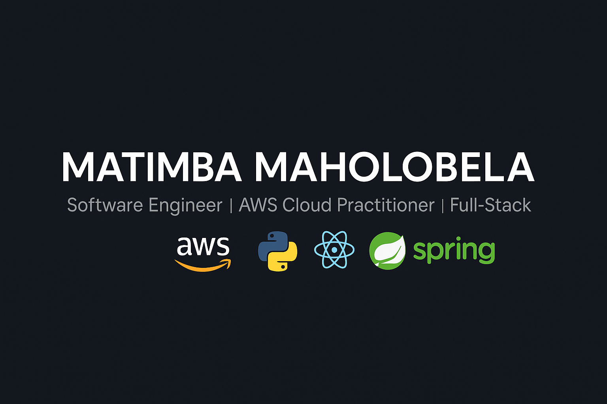

<!-- Header Banner -->

  

---

# 👋 Hey there! I'm **Matimba Maholobela**

🔧 **Software Engineer** • ☁️ **AWS Cloud Practitioner** • 💻 **Full-Stack Developer** • 🚀 **Continuous Learner**

Welcome to my GitHub space!  
I’m a dedicated software engineer passionate about **building scalable, maintainable, and impactful systems**.  
With expertise in **software development, cloud computing, and DevOps**, I aim to deliver solutions that make a difference.

> 🏅 Proud recipient of multiple **SEACOM Excellence in Action Awards**

---

## 🎓 **Certifications**

- 🎓 **BSc in Computer Science & Applied Statistics – University of Cape Town**  
- 🏆 **AWS Certified Cloud Practitioner**  
- 🚀 **AWS Certified Developer – Associate (In Progress)**  
- 💼 **SEACOM - Excellence in Action Certificates (Multiple)**  

---

## 👨‍💼 **Current Role**

### 🏢 Lead Software Engineer @ [Storage Sprint](https://www.storagesprint.co.za)

Leading a team of five developers to build a logistics-focused web application managing package movements across Cape Town.

#### 🧠 **Responsibilities**
- Architecting and managing full-stack solutions  
- Overseeing CI/CD pipelines and agile workflows  
- Ensuring scalability, performance, and security  

#### ✨ **Key Features**
- Real-time **package tracking**  
- Secure **PayFast** payment integration  
- RESTful backend (**Django**) + reactive frontend (**React**)  

#### ⚙️ **Tech Stack**

**Backend:** Django REST Framework, Spring  
**Frontend:** React  
**Database:** Amazon RDS  
**Containerization:** Docker  
**Hosting:** AWS & DigitalOcean  
**Integrations:** Google Maps, Zoho Books, PayFast  

---

## 🚀 **Featured Projects**

### 🌐 [SQL Assignment System](https://github.com/MatimbaMaholobela/sqltest-system)
A system that streamlines **SQL assignment creation and grading** for computer science students using Django.

**Tech:** Django • Python • SQL  
**Highlights:**
- Automated SQL query evaluation  
- Simplified instructor UI  
- Optimized for classroom scalability  

---

### 🩺 [CS2 Admin System](https://github.com/MatimbaMaholobela/cs2-admin-system)
Admin portal for managing **academic certificates, waivers, and extensions** with a Django REST backend.

**Tech:** Django • REST APIs  
**Highlights:**
- Secure, role-based management  
- RESTful integration with frontend  

---

### ☕ [To-Do List Application](https://github.com/MatimbaMaholobela/to-do-list-app)
A **Spring-based task management app** with persistent storage and analytics.

**Tech:** Java • Spring • SQLite  
**Highlights:**
- Full CRUD functionality  
- Analytics dashboard  
- Clean and minimal UI  

---

### 🧩 [DNS Server with APL Record Support](https://github.com/MatimbaMaholobela/DNS-Server-APL-Record)
A **custom DNS server** built in Python using Twisted, supporting the experimental APL (Address Prefix List) record.

**Tech:** Python • Twisted  
**Highlights:**
- Implements APL per RFC  
- Low-level network programming  
- Custom DNS protocol logic  

---

## ⚙️ **Tech Stack & Skills**

### 💻 **Languages & Frameworks**

- **Python:** Django, REST Framework, Twisted  
- **Java:** Spring Framework  
- **JavaScript:** React  
- **SQL:** PostgreSQL, MySQL, SQLite, Amazon RDS  

---

### ☁️ **Cloud & DevOps**

- **AWS:** EC2, S3, RDS, IAM, CloudFormation  
- **Docker:** Containerization & Orchestration  
- **CI/CD:** GitHub Actions  
- **Linux:** Ubuntu, FreeBSD  

---

### 🧰 **Tools & Methodologies**

- **Agile Project Management:** Jira, Confluence  
- **Version Control:** GitHub, GitLab  
- **Collaboration:** Code reviews, documentation-first  

---

## 📊 **GitHub Insights**

  
  

  

---

## 🏆 **GitHub Trophies**

  

---

## 📈 **Contribution Graph**

  

---

## 🤝 **Let’s Connect**

> 💬 Open to **collaboration**, **new ideas**, and **tech discussions**!

---

## 🎯 **Fun Fact**
> I’m always exploring new frameworks, automating workflows, and building solutions that make life easier — **one line of code at a time**.
