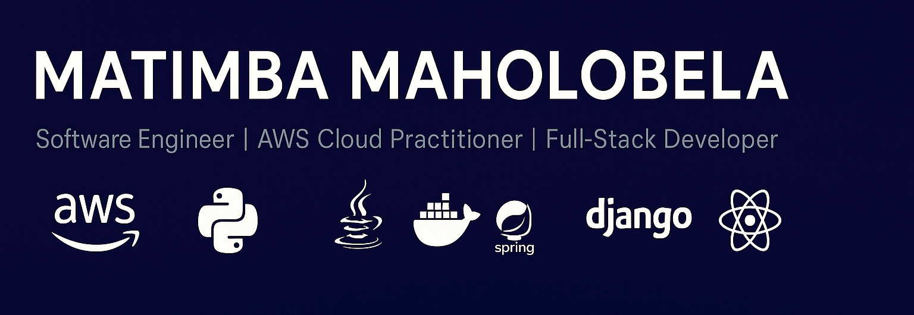

<!-- Header Banner -->

  

---

# 👋 Hey, I'm **Matimba Maholobela**

🔧 **Software Engineer** • ☁️ **AWS Cloud Practitioner** • 💻 **Full-Stack Developer** • 🚀 **Continuous Learner**

> Crafting **scalable, maintainable, and impactful systems** with a love for **cloud, DevOps, and full-stack development**.

🏅 Proud recipient of **SEACOM Excellence in Action Awards**

---

## 🎓 Certifications & Education

🎓 **BSc in Computer Science & Applied Statistics – University of Cape Town**  
🏆 **AWS Certified Cloud Practitioner**  
🚀 **AWS Certified Developer – Associate (In Progress)**  
💼 **SEACOM Excellence in Action Certificates (Multiple)**  

---

## 💼 Current Role

### 🏢 Lead Software Engineer @ [Storage Sprint](https://www.storagesprint.co.za)

  

**Responsibilities:**
- Architecting full-stack solutions  
- Managing **CI/CD pipelines** & agile workflows  
- Ensuring scalability, performance & security  

**Highlights:**
- Real-time **package tracking system**  
- Secure **PayFast** payment integration  
- **Django REST** backend + **React** frontend  

---

## 🚀 Featured Projects

| Project | Description | Tech & Highlights |
|---------|------------|-----------------|
| [SQL Assignment System](https://github.com/MatimbaMaholobela/sqltest-system) | Streamlines **SQL assignment creation & grading** | Django • Python • SQL • Automated query evaluation |
| [CS2 Admin System](https://github.com/MatimbaMaholobela/cs2-admin-system) | Manage **academic certificates & waivers** | Django • REST APIs • Role-based access |
| [To-Do List App](https://github.com/MatimbaMaholobela/to-do-list-app) | **Task manager with analytics** | Java • Spring • SQLite • CRUD + Dashboard |
| [DNS Server w/ APL Support](https://github.com/MatimbaMaholobela/DNS-Server-APL-Record) | **Custom DNS server supporting APL records** | Python • Twisted • Networking & RFC-compliant |

---

## 🛠 Tech Stack & Skills

### 💻 Languages & Frameworks

  

### ☁️ Cloud & DevOps

  

### 🧰 Tools & Methodologies

  

---

## 📊 GitHub Insights

---

## 🤝 Connect with Me

💬 Open to **collaboration**, **tech discussions**, and **new ideas**!  

---

## 🎯 Fun Fact

> Automating workflows, exploring new frameworks, and building solutions that make life easier — **one line of code at a time**.
